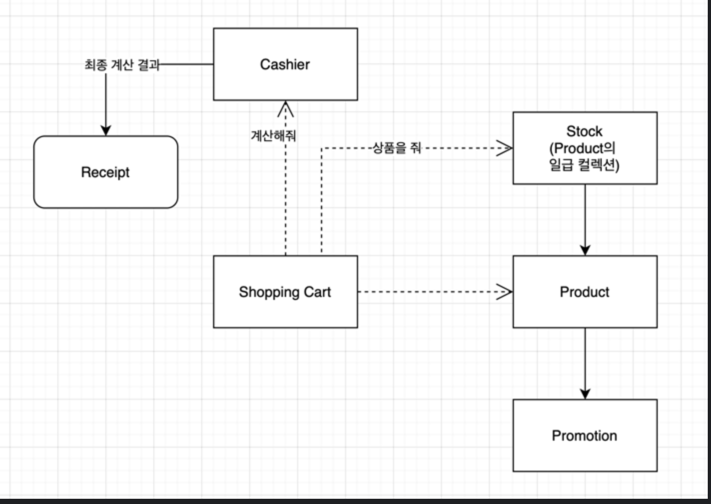

# java-convenience-store-precourse

# 목표
* 구매자의 할인 혜택과 재고 상황을 고려하여 최종 결제 금액을 계산하고 안내하는 결제 시스템을 구현한다.

# 기능 요구사항

## 재고 관리
* 주문이 들어오면 재고를 확인한다
    + 재고 수량을 고려해 결제 가능 여부를 확인
* 주문 결제 완료 시, 수량에 맞게 재고를 차감한다

## 프로모션 할인
* 프로모션 재고에 대해 프로모션을 적용시킨다
    + 오늘 날짜가 프로모션 기간 내라면 할인을 적용
    + 프로모션은 1+1 or 2+1 의 형태, 한 상품은 하나의 프로모션만 적용
    + 프로모션 재고 내에서만 적용 가능
    + 프로모션 기간이라면, 프로모션 재고 우선 사용
    + 프로모션 적용 가능한 상품에 대해 해당 수량보다 적게 구매 시, 프로모션 적용에 필요한 수량 안내
    + 프로모션 재고가 부족하여 적용 불가 시에는 그 수량에 대해 정가로 결제

## 멤버십 할인
* 멤버십 할인 적용
    + 프로모션 할인 적용 후 멤버십 할인 적용
    + 프로모션 할인이 적용된 상품 수량은 해당 X
    + 멤버십 할인의 최대 한도는 8,000원

## 영수증 출력
* 구매 내역과 할인을 요약하여 출력
    + 구매 상품 내역 : 구매한 상품명, 수량, 가격
    + 증정 상품 내역 : 프로모션에 따라 무료로 제공된 상품 목록
    + 금액 정보 :
        - 총 구매액 : 총 구매 수량과 총 금액
        - 프로모션 할인 : 프로모션에 의해 할인된 금액
        - 멤버십 할인 : 멤버십 할인에 의해 할인된 금액
        - 내실 돈 : 최종 결제 금액

# 객체 설계도

